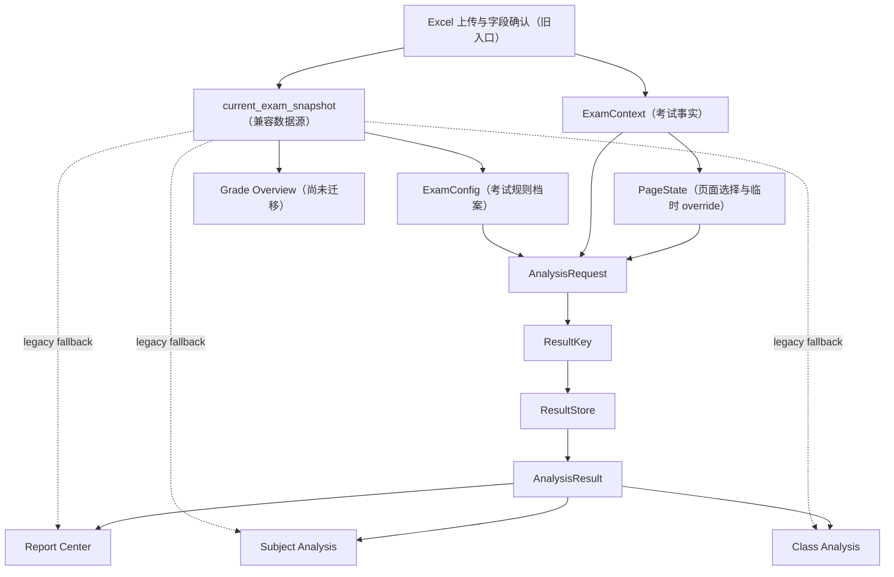

# 成绩分析网站架构冻结基线 V1

本文记录 Phase 3.2.5 完成时的架构事实、迁移边界和后续兼容约束。它是后续 Phase 3.3 的变更基线，不代表旧流程已经全部移除，也不授权重构成绩计算、Excel 解析、学生身份或报告生成逻辑。

## 1. 当前系统架构图



当前是渐进迁移期：新对象和旧 `current_exam_snapshot`、旧页面状态并行存在。新架构链路已经在三个页面落地，但旧链路仍承担兼容回退；Grade Overview 仍负责考试建立、主要计算和 snapshot 生成。

## 2. 页面迁移状态

### 2.1 已迁移页面

| 页面 | 新架构入口 | 缓存未命中 | 当前 fallback |
|---|---|---|---|
| Report Center（报告中心） | 局部报告 PageState → AnalysisRequest → ResultKey → ResultStore | 将 snapshot 中旧 `analysis_result` 适配为 AnalysisResult 后保存 | 新架构对象缺失或构造失败时，继续使用 snapshot 旧报告输入 |
| Subject Analysis（学科分析） | ExamContext + ExamConfig + 学科 PageState → `get_or_build_subject_result()` | 注入原学科计算 callback，适配并保存结构化结果 | 新对象缺失、服务返回空值或页面转换失败时调用 `render_subject_analysis_page(snapshot)` |
| Class Analysis（班级分析 / class comparison） | ExamContext + ExamConfig + 班级 PageState → `get_or_build_class_result()` | 注入原班级比较 callback，适配并保存结构化结果 | 新对象缺失、服务返回空值或页面转换失败时调用 `render_class_analysis_page(snapshot)` |

上述迁移均采用“新架构优先、旧流程 fallback”，没有删除旧计算入口。

### 2.2 未迁移页面

| 页面 | 当前状态 | 冻结结论 |
|---|---|---|
| Grade Overview（年级总览） | 仍使用上传 Excel、字段识别、旧 session state、`analysis_result` 与 `current_exam_snapshot` 主流程 | Phase 3.3 前不得假定其已使用 AnalysisRequest、ResultStore 或 AnalysisResult |
| 成绩变化、教师视角、学生成长等后续页面 | 尚未形成完整的新架构分析链路 | Phase 4 前不得绕过统一请求和结果契约新增独立业务真值 |

## 3. 新架构核心对象职责

### 3.1 ExamContext

表示“这场考试有什么数据”。负责：

- `exam_id` 与文件元数据；
- 已确认的姓名、班级、学号和成绩列映射；
- 原始 DataFrame index → 学生身份记录；
- 原始 DataFrame index → 各科成绩。

它不保存页面选择、满分/优秀率 override、图表、Word 文件或当前路由。创建后页面只读，不允许原地修改。

### 3.2 ExamConfig

表示“这场考试默认如何评价”。负责：

- 每科默认满分；
- 默认及格比例、优秀比例；
- 等级规则和配置版本。

页面临时调整属于 PageState override，不得直接写回 ExamConfig。当前已迁移页面对 ExamConfig 只读。

### 3.3 PageState

表示“用户当前怎么看、临时怎么调整”。负责：

- 页面名称；
- 当前科目；
- 当前班级集合；
- 当前页面、当前科目的临时 `config_overrides`；
- 兼容期的 `route` 与 `by_exam` 结构。

PageState 可以由对应页面更新，但不能包含学生成绩、身份数据或 ExamConfig 真值。不同页面应使用独立页面语义，报告中心使用局部 PageState，不能改写全局页面状态。

### 3.4 AnalysisRequest

描述一次分析意图，不包含原始成绩和展示对象。它由 ExamContext、ExamConfig、PageState 纯函数构造，至少冻结：

- 考试、页面和分析类型；
- 科目与规范化班级集合；
- 配置版本、配置签名和页面状态签名。

构造过程不得修改任一输入；三个对象的 `exam_id` 必须一致。

### 3.5 ResultKey

是分析结果的唯一身份。由 AnalysisRequest 的规范化内容生成稳定 SHA-256 请求签名。考试、科目、班级集合、配置版本或相关 override 变化时，应产生不同 key。

### 3.6 ResultStore

是实例级、纯内存的 `ResultKey → AnalysisResult` 容器。负责：

- 深拷贝保存和读取；
- 同 key 覆盖；
- 不同 key、不同实例之间隔离；
- 清空当前实例结果。

ResultStore 不读取 session state，不依赖 Streamlit，不调用 Excel 或成绩计算。

当前 V1 的 figure 边界由调用方和结果构造层保证：已迁移学科/班级 callback 只返回指标、表格、等级结构及绘图所需数据，页面命中缓存后重新生成图表。ResultStore 当前是通用容器，本身不承担 Plotly 类型过滤；在增加统一结果校验器之前，任何写入方都不得将 Plotly figure、Streamlit 对象或文件对象放入 AnalysisResult。

### 3.7 AnalysisResult

是统一结构化结果契约，包含：

- `result_key`；
- `metadata`；
- `payload.summary`；
- `payload.metrics`；
- `payload.tables`；
- `payload.charts`（图表数据，不是 figure）；
- `payload.extra`。

旧 `analysis_result` 通过 adapter 转换；未知字段必须保留，不能因为迁移丢失旧报告或页面所需数据。

## 4. 页面访问与写入规则

页面可以：

1. 读取 ExamContext；
2. 读取 ExamConfig；
3. 读取并更新本页面 PageState；
4. 构造 AnalysisRequest 或调用对应业务服务；
5. 读取 AnalysisResult，并从数据重新生成图表；
6. 在兼容期满足明确条件时进入旧 fallback。

页面禁止：

1. 直接修改 ExamContext、身份映射或成绩映射；
2. 直接修改 ExamConfig；
3. 把 widget/session_state 值当作考试规则唯一真值；
4. 把 Plotly figure、Streamlit 对象、文件对象写入 ResultStore；
5. 在已迁移页面重新读取 Excel 或重新生成学生身份；
6. 通过姓名匹配替代原始行 index 与 `identity_key` 的关联；
7. 为新页面创建绕过 AnalysisRequest、ResultKey、AnalysisResult 的长期结果缓存。

当前配置优先级继续遵守：

```text
PageState Override
        ↓
ExamConfig
        ↓
System Default
```

临时 override 默认不修改考试标准；只有未来明确的“保存为考试规则”命令才允许通过专门配置服务创建新版 ExamConfig。

## 5. 当前 fallback 策略

fallback 是迁移期的兼容机制，不是新的主架构。

### 5.1 触发条件

- `current_exam_context`、`current_exam_config` 或所需 PageState 缺失；
- ResultStore 尚未初始化且页面无法安全初始化；
- 新请求构造因兼容期旧状态不完整而失败；
- 新服务明确返回 `None`；
- 新结构化页面在受控异常范围内无法完成转换或渲染。

### 5.2 页面行为

- Report Center：回到 snapshot 的旧 `analysis_result`，继续调用原 `build_score_report_bytes()` 参数结构；
- Subject Analysis：回到 `render_subject_analysis_page(snapshot)`；
- Class Analysis：回到 `render_class_analysis_page(snapshot)`；
- Grade Overview：本身仍是旧主流程，不属于 fallback。

### 5.3 删除条件

任一 fallback 只有在以下条件全部满足后才可删除：

1. 新旧结果逐字段一致；
2. 缺失新对象的旧会话升级路径已处理；
3. 同名、跨班同名和有学号同名学生回归通过；
4. 页面切换不污染其他页面配置；
5. 报告内容、Word 接口和自动滚动保持一致；
6. 全量回归连续通过，且静态搜索确认无剩余调用方。

## 6. 冻结接口与禁止破坏项

Phase 3.3 开始前，以下接口视为迁移基线：

- `build_analysis_request(exam_context, exam_config, page_state, *, analysis_type=None)`；
- `build_result_key(analysis_request)`；
- `ResultStore.save/get/exists/clear`；
- `adapt_analysis_result(result_key, legacy_result, ...)`；
- `get_or_build_report_result(...)`；
- `get_or_build_subject_result(..., calculate_callback)`；
- `get_or_build_class_result(..., calculate_callback)`；
- `analysis_result_to_legacy_dict(...)`；
- `build_score_report_bytes()` 的既有参数结构；
- ExamContext 中基于原始行 index 的身份与成绩关联；
- `current_exam_snapshot` 和旧 `analysis_result` 的兼容可用性。

若后续确需修改上述接口，应先增加兼容测试和迁移说明，不能同步删除旧构造或 fallback。

## 7. 未来迁移路线

### Phase 3.3：Grade Overview

建议继续拆成小步：

1. 固化考试建立与字段确认边界，避免 rerun 重复读取 Excel；
2. 从 ExamContext 按原始行 index 构造年级分析输入；
3. 用 ExamConfig + PageState override 解析有效满分与评价线；
4. 构造 Grade Overview 的 AnalysisRequest 与 ResultKey；
5. 通过原计算 callback 生成结构化 AnalysisResult；
6. 接入 ResultStore，新架构优先并保留旧年级流程 fallback；
7. 验证报告、学科、班级页面以及上传后自动滚动不受影响。

Phase 3.3 不应修改 `grade_logic.py` 的公式、Excel 解析规则或 `student_identity.py` 身份规则。

### Phase 4：新功能开发与旧状态清理

在 Grade Overview 迁移稳定后，再开始：

- AI 分析、学生成长、考试趋势等新功能；
- 为 ExamConfig 增加明确的版本化保存入口；
- 清理已无调用方的旧 session state；
- 逐步缩小并最终删除 snapshot/fallback；
- 建立统一 ResultPayload 校验，强制拒绝 figure、UI 与文件对象；
- 按 ResultKey 管理结果失效和报告缓存。

新功能必须直接遵守 Context / Config / PageState / Request / Result 边界，不能再复制一套页面专属业务真值。

## 8. 冻结基线验收标准

本架构冻结点满足以下条件才有效：

- Report Center、Subject Analysis、Class Analysis 保持新架构优先；
- Grade Overview 明确标记为未迁移；
- 三个已迁移页面不写 ExamConfig；
- 服务层不依赖 Streamlit；
- AnalysisRequest 构造不修改输入对象；
- 已迁移结果缓存只包含结构化数据，不包含 figure 对象；
- 三个旧 fallback 继续存在并可用；
- 本阶段不修改页面、模型、服务或成绩业务逻辑；
- 新增架构边界测试和现有回归均通过。

本文与既有文档的关系：`architecture_design.md` 定义长期目标，`migration_plan.md` 定义迁移顺序，`config_priority.md` 定义配置判定规则；本文只冻结 Phase 3.2.5 时已经实现的事实和不可破坏边界。
